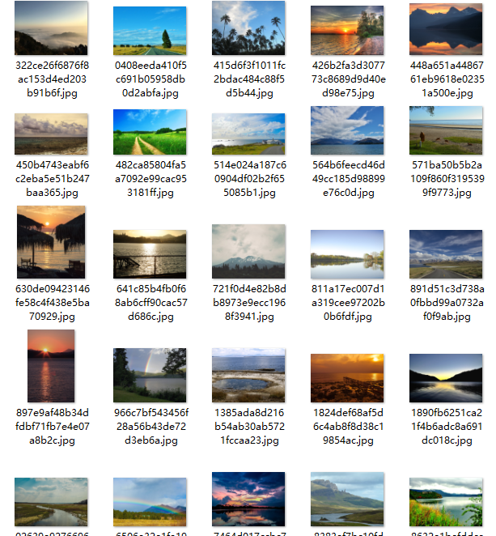
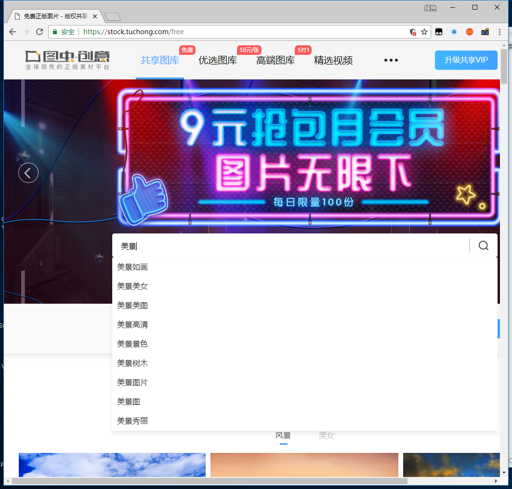
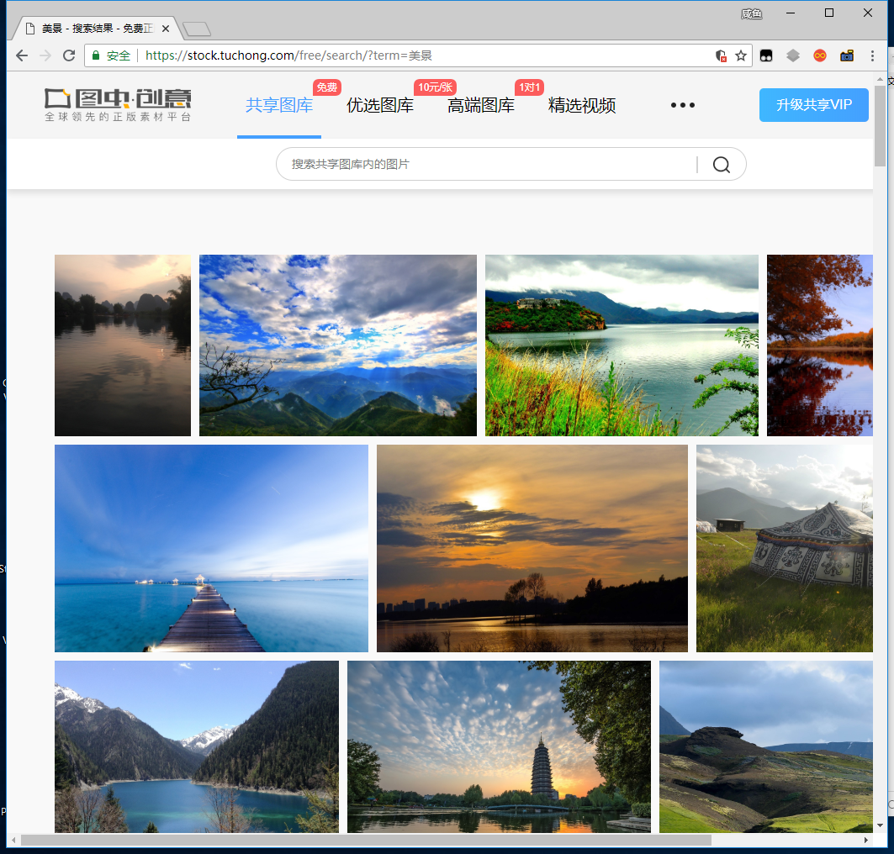
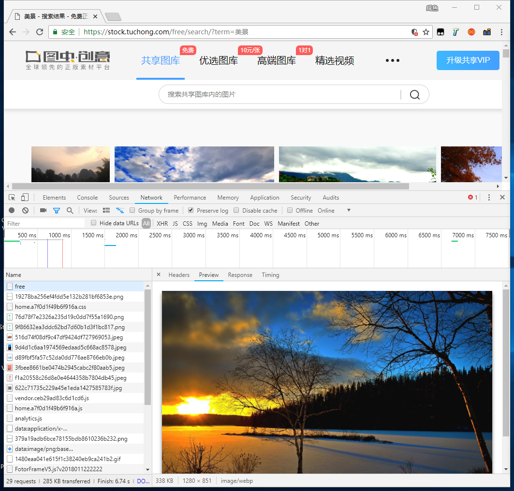
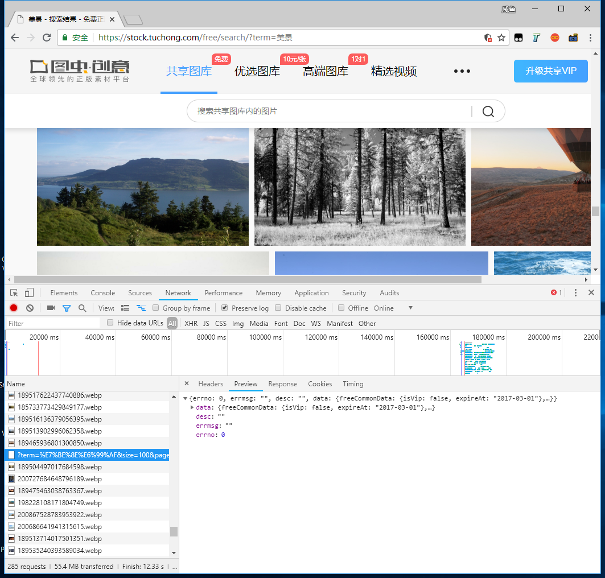
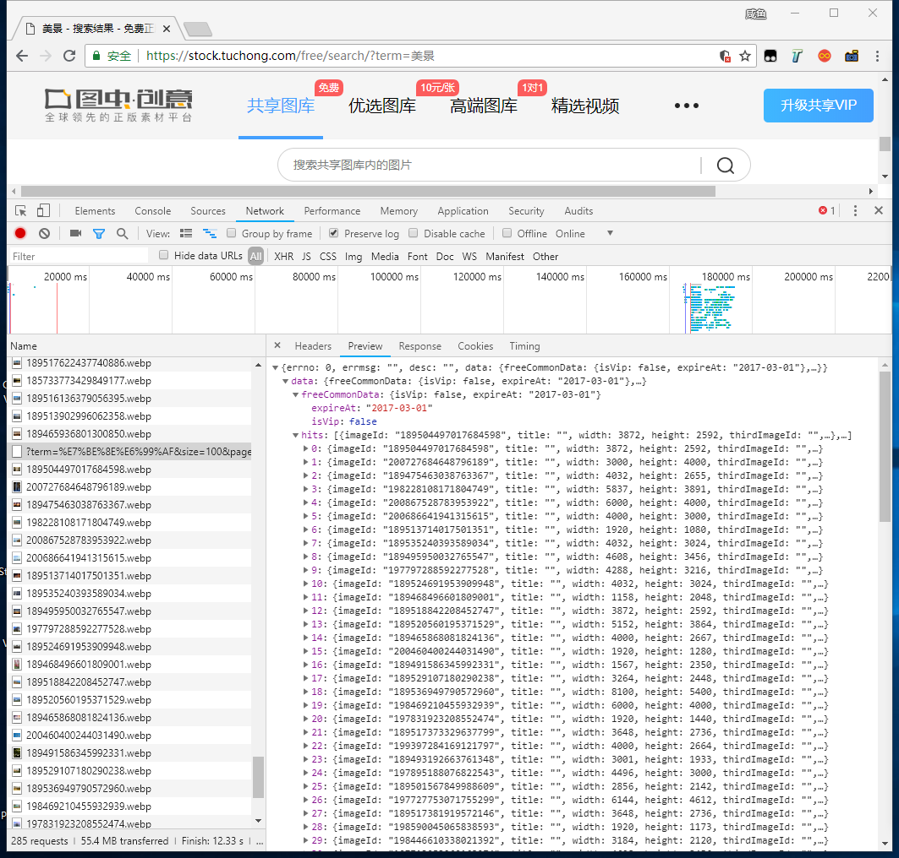
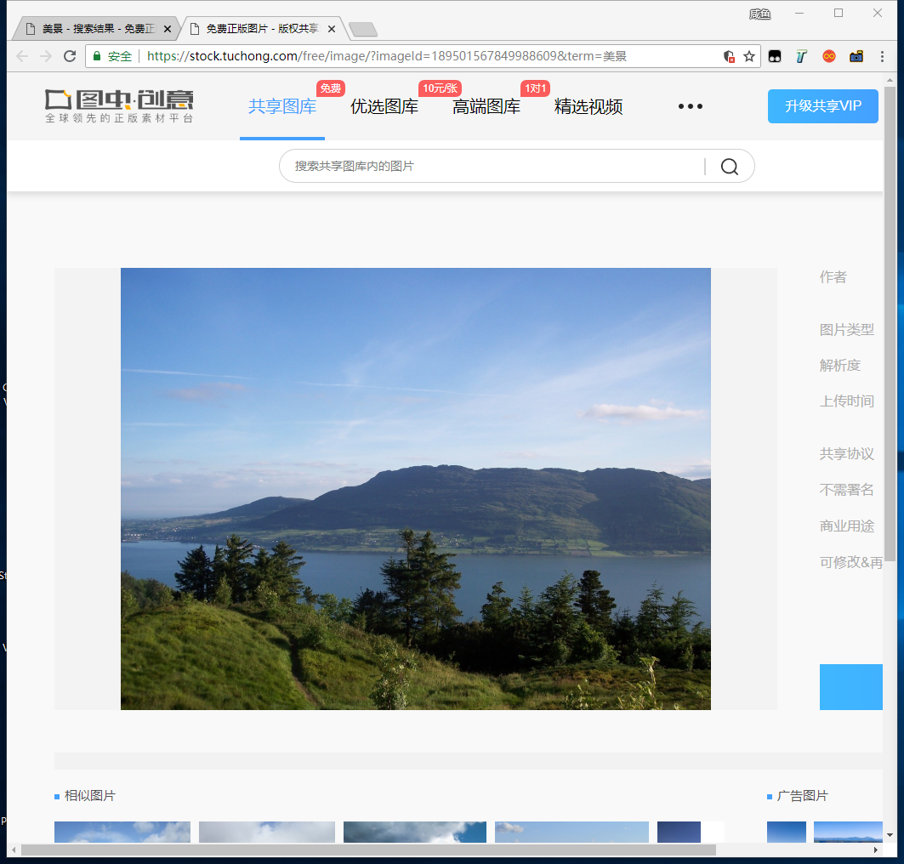
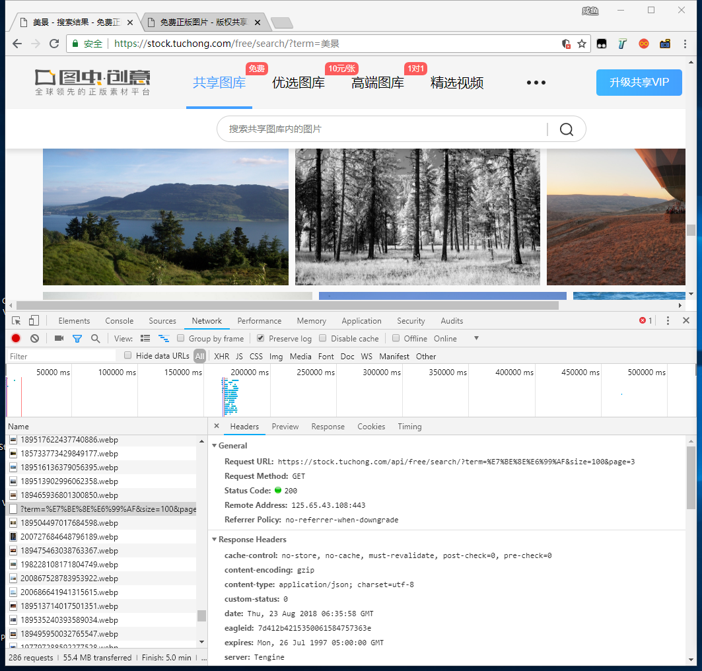
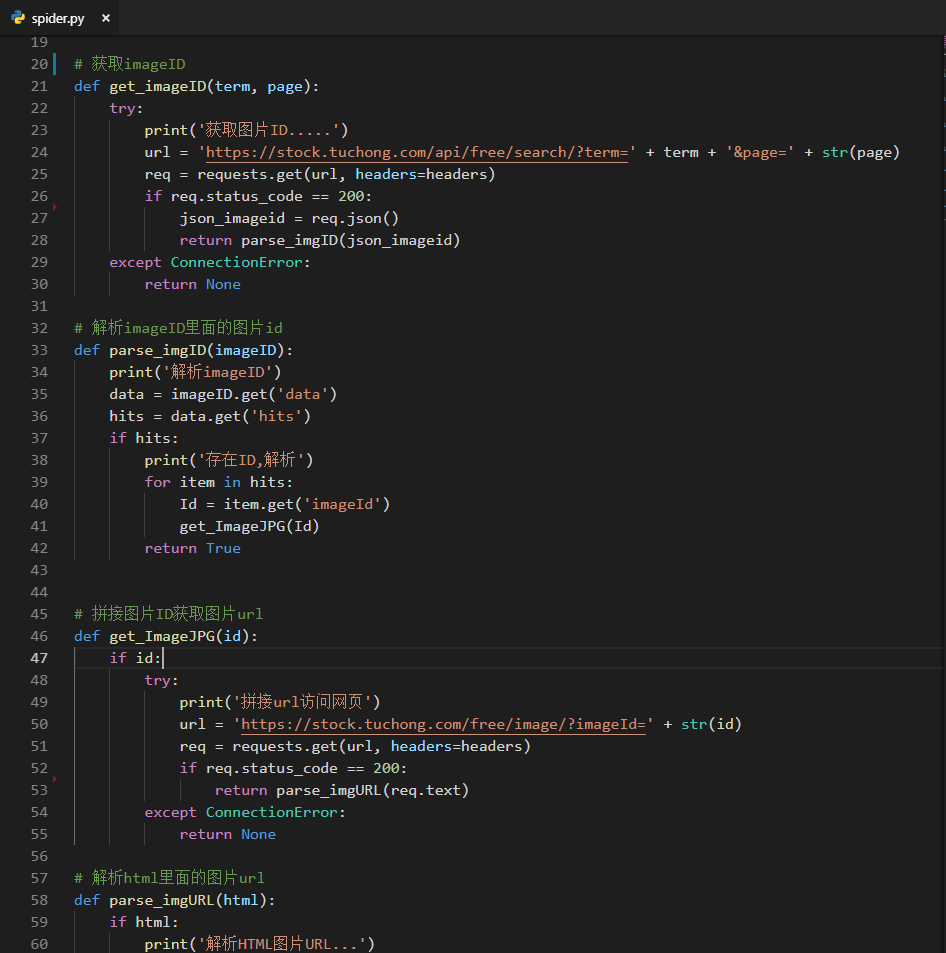

# 			TuChong_Spider

*偶然的机会在抖音看到这个APP,发现有很多高质量的手机壁纸和图片,对于一个爬虫初学者,这就非常美滋滋了,好多欧美小姐姐啊,哎嘿嘿....*

*图虫网共享图库爬虫, 通过抓取Ajax获取图片ID进行图片保存*

爬取网站: https://stock.tuchong.com

爬取结果



### ***运行环境:***

- Python 3.5+
- Windows 10
- VSCode

### **如何使用**

##### 下载项目源码

`https://github.com/cexll/tuchong_Spider.git`

##### 安装依赖

`$ pip install -r requirements.txt`

### 运行项目

```
$ python spider.py
输入想要搜索的内容: 少女
获取图片ID.....
解析imageID
存在ID,解析
解析HTML图片URL...
准备下载... //p3a.pstatp.com/weili/l/199813*************89.jpg
下载成功----------------------
拼接url访问网页
解析HTML图片URL...
准备下载... //p3a.pstatp.com/weili/l/189***********417.jpg
下载成功----------------------
拼接url访问网页
解析HTML图片URL...
准备下载... //p3a.pstatp.com/weili/l/1**************25.png
拼接url访问网页
解析HTML图片URL...
准备下载... //p3a.pstatp.com/weili/l/2***********62820.jpg
拼接url访问网页
解析HTML图片URL...
准备下载... //p3a.pstatp.com/weili/l/************2.jpg
拼接url访问网页
...
```

*图片链接我就大码了*


### 思路(前方高能,请流量党注意)

首先爬取一个网页,第一步,先打开这个网页


打开之后,先看看怎么搜索图片,下载图片的..





可以看到,图虫网的图片还是不错的

回到正题~

打开`开发者工具`(F12 或者右键 ,然后刷新



然后看一看有没有什么有用的东西....好像仔细找了找是没有发现什么有用的...怎么办呢?


网页往下翻一翻,,,,,




图片中间出现了个`数据包`....这就是我们需要的东西,,但是打开发现不对啊,怎么没有图片下载的链接??



哎,别慌,先去网页打开一个图片看看是什么结构的...



到这里我们发现了,网页url链接有个`imageID=`这东西,好像和之前找到个`数据包`内容是一样的,,,打开后发现的确是一样的

那么整体的结构就清楚了,先把刚才的`数据包`链接打开看看是什么




仔细看了看,发现最开始都有`imageID`,那么思路就有了

通过访问`数据包`的链接得到每一页的`imageID`,在用 `https://stock.tuchong.com/free/image/?` + imageID就可以访问到图片了,好的 coding

### 代码




### 总结

抓取所有的网页都是类似的思路,首先先通过人的逻辑去找到数据,在通过代码去得到,不要一来就上手代码,

细心的朋友肯定发现了,我们抓的是免费图库里的图片,是的,至于为什么不抓`优选图库`,`高端图库`,1是我也是才发现他们不一样,2是别人赚钱的生意我就这样发出来了万一被抓了怎么办....

有能力的可以自己去琢磨一下,我上次看了一下`imageID`这次是保存在HTML里面的,有点类似今日头条的


